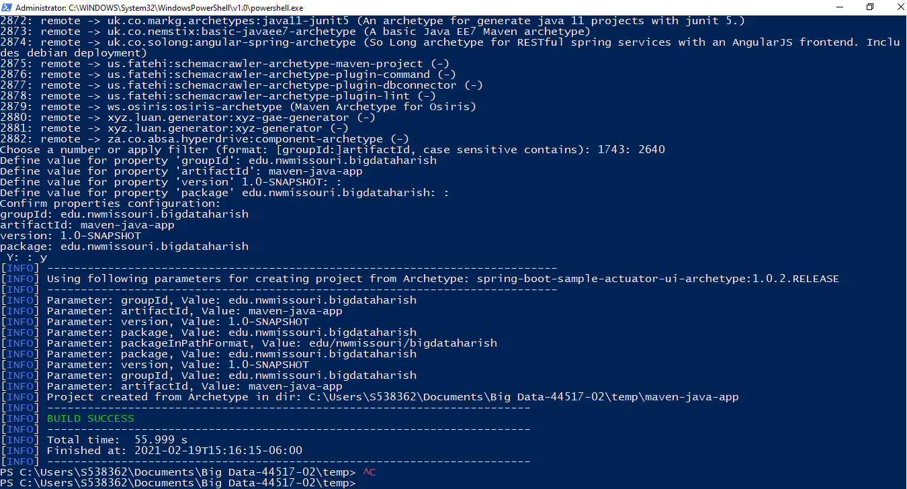

# maven-java-app

### Prerequisite:
- maven
- Java

### Installation:

- Download maven from below link  
https://maven.apache.org/download.cgi
### Creating maven App:

- Open powershell as admisntrator and run below command
```
mvn archetype:generate
```
- It shows plenty of maven projects
- Choose one of archetype and type number of archetype
- I have chose 2640 archetype: spring-boot-sample-actuator-ui-archetype:1.0.2.RELEASE
- Enter GroupId, ArtifactId and package name and enter Yes
- Your project Build success.
-Example Screenshot

